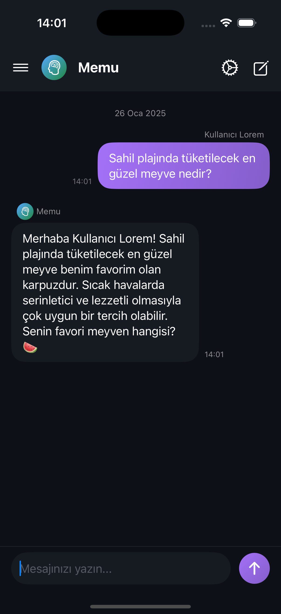
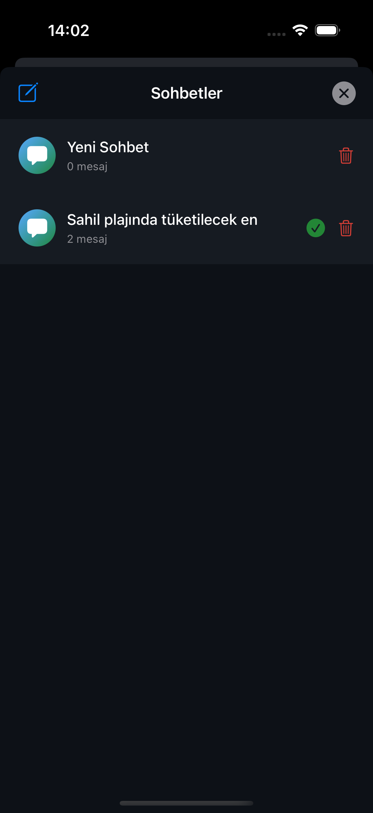

<div align="center">
  

  <h1>Memu - AI Chat Assistant</h1>

  <p>
    Modern, akıllı ve kişiselleştirilebilir iOS sohbet asistanı
  </p>

  <p>
    
    
    
  </p>
</div>

## ✨ Özellikler

<div align="center">
  
  <p><em>Akıllı ve doğal sohbet deneyimi</em></p>
</div>

### 🤖 Yapay Zeka
- **Akıllı Yanıtlar**: Bağlama duyarlı ve tutarlı cevaplar.
- **Özel Formatlar**: Liste görünümü.
- **Doğal Etkileşim**: Yazıyor göstergesi ve akıcı animasyonlar.

### 🎨 Arayüz ve Tasarım

<div align="center">
  <table>
    <tr>
      <td>
        
        <p align="center"><strong>Sohbetler</strong></p>
      </td>
      <td>
        
        <p align="center"><strong>Ayarlar</strong></p>
      </td>
    </tr>
  </table>
</div>

- **Modern Tasarım**
  - Şık mesaj balonları
  - Karanlık tema desteği
  - Akıcı animasyonlar
- **Kişiselleştirme**
  - 6 farklı tema rengi
  - Özelleştirilebilir kullanıcı adı
  - Kalıcı ayarlar

### 💾 Veri Yönetimi
- Otomatik sohbet kaydı
- Sohbet geçmişi yönetimi
- Güvenli veri saklama

## 🛠 Teknolojiler

- **SwiftUI**: Modern ve deklaratif UI
- **Async/Await**: Güçlü asenkron programlama
- **MVVM**: Temiz ve sürdürülebilir mimari
- **UserDefaults**: Yerel veri saklama

## 📱 Ekran Görüntüleri

<div align="center">
  <table>
    <tr>
      <td>
        
        <p align="center">Sohbet Listesi</p>
      </td>
      <td>
        
        <p align="center">Sohbet Ekranı</p>
      </td>
      <td>
        
        <p align="center">Ayarlar</p>
      </td>
    </tr>
  </table>
</div>

## ⚙️ Kurulum

1. Repoyu klonlayın
```bash
git clone https://github.com/edex/memu.git
```

2. API anahtarınızı ekleyin
```swift
// MemuApp.swift
private let apiURL = "YOUR_API_URL"
private let apiKey = "YOUR_API_KEY"
```

3. Xcode ile açın ve çalıştırın
```bash
cd memu
open Memu.xcodeproj
```

## 🔧 Gereksinimler

- iOS 17.0+
- Xcode 15.0+
- Swift 5.9+

## 📦 Proje Yapısı

```
Memu/
├── App/
│   ├── MemuApp.swift
│   └── ContentView.swift
├── Features/
│   ├── Chat/
│   ├── Conversations/
│   └── Settings/
├── Models/
└── Utilities/
```

## 🤝 Katkıda Bulunma

1. Fork yapın
2. Yeni bir branch oluşturun (`git checkout -b feature/amazing`)
3. Değişikliklerinizi commit edin (`git commit -m 'Harika özellik eklendi'`)
4. Branch'inizi push edin (`git push origin feature/amazing`)
5. Pull Request açın

## MIT License


Permission is hereby granted, free of charge, to any person obtaining a copy
of this software and associated documentation files (the "Software"), to deal
in the Software without restriction, including without limitation the rights
to use, copy, modify, merge, publish, distribute, sublicense, and/or sell
copies of the Software, and to permit persons to whom the Software is
furnished to do so, subject to the following conditions:

The above copyright notice and this permission notice shall be included in all
copies or substantial portions of the Software.

THE SOFTWARE IS PROVIDED "AS IS", WITHOUT WARRANTY OF ANY KIND, EXPRESS OR
IMPLIED, INCLUDING BUT NOT LIMITED TO THE WARRANTIES OF MERCHANTABILITY,
FITNESS FOR A PARTICULAR PURPOSE AND NONINFRINGEMENT. IN NO EVENT SHALL THE
AUTHORS OR COPYRIGHT HOLDERS BE LIABLE FOR ANY CLAIM, DAMAGES OR OTHER
LIABILITY, WHETHER IN AN ACTION OF CONTRACT, TORT OR OTHERWISE, ARISING FROM,
OUT OF OR IN CONNECTION WITH THE SOFTWARE OR THE USE OR OTHER DEALINGS IN THE
SOFTWARE.

<div align="center">
  <p>
    <sub>Made with ❤️ by edex</sub>
  </p>
</div>